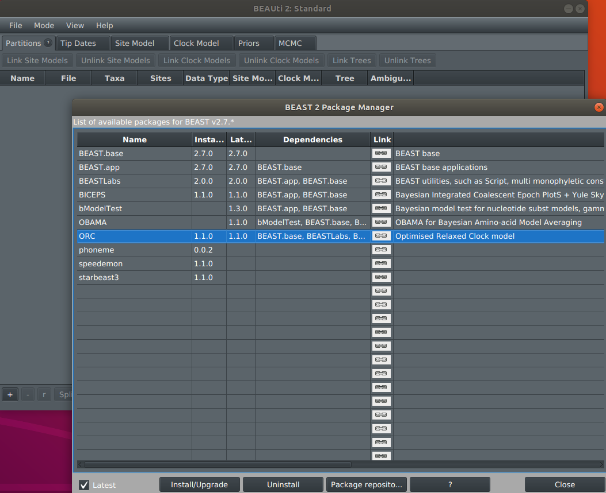

# ORC - Optimised Relaxed Clock

A BEAST 2 package containing a series of optimisations made to improve the performance of the phylogenetic relaxed clock model. 
Depending on the dataset, the methods presented here can yield relaxed clock model mixing up to 65 times faster than the standard BEAST 2 relaxed clock model setup.
The gap widens as the alignment becomes longer making this package very effective at doing inference on long alignments.

"Adaptive dating and fast proposals: revisiting the phylogenetic relaxed clock model." J. Douglas, R. Zhang, and  R. Bouckaert
 https://doi.org/10.1371/journal.pcbi.1008322

Also see BEAST 2 [blog post](https://www.beast2.org/2020/12/15/ORC.html)

The main branch of this repository is for BEAST 2.7. To see example sessions and code compatible with 2.6, please refer to the v2.6 branch.

## Installation instructions

Both installation pathways assume you have BEAST 2 already installed on your machine https://www.beast2.org/

### BEAUti

1. Launch BEAUti
2. Click on File -> Manage Packages

3. Install ORC

4. Import an alignment and set up the model as per usual

5. On the Clock Model tab, select 'Optimised Relaxed Clock' from the dropdown menu

6. To confirm this has worked, display the Operators tab by pressing `View => Show operators panel`

7. You should see the following 4 adaptive operators in the Operators tab:

8. File -> Save As and run the .xml file using BEAST 2 as per usual

## Automated generation of Narrow Exchange Rate operators
Run matlab/GenerateOperators.m using MATLAB to generate all 47 solvable operators with non-zero Jacobians from the complete set of 63 (excluding narrow exchange)

## Benchmarking results

For xml files used during benchmarking, please see

https://github.com/jordandouglas/ClockModelPaper

Please note that these xml files are dependent on the 'FastRelaxedClockLogNormal' package, which can be installed using beauti

## Citation

Jordan Douglas, Rong Zhang,Remco Bouckaert. 
Adaptive dating and fast proposals: Revisiting the phylogenetic relaxed clock model. PLoS computational biology. 2021 Feb 2;17(2):e1008322.
<a href="https://doi.org/10.1371/journal.pcbi.1008322">link</a>
